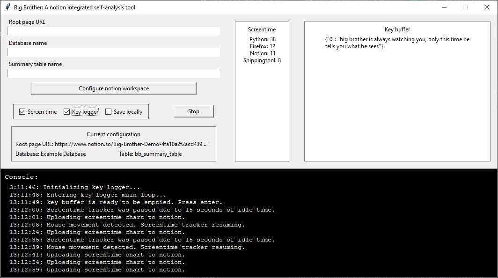
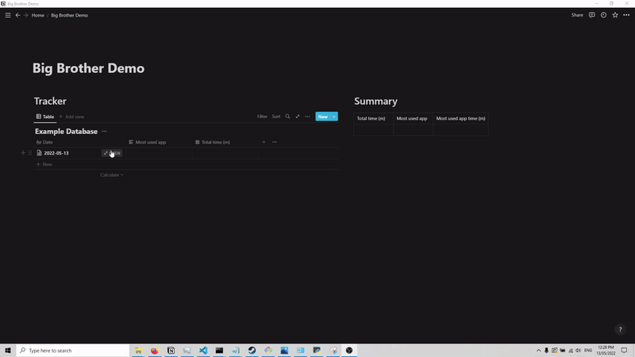

# Notion_BigBrother
A notion-integrated key logger and screentime tracker.

Big brother is a simple python tool that monitors how you spend your time on the computer. It is intended to be used as a self-analysis tool. It makes no attempt at concealing itself and is not packages as an .exe file. 

## Usage
Big brother was developed and tested with Python 3.10.4

1. Clone repository to local folder
2. Open cmd and navigate to local folder
3. Install necessary python libraries with `pip install -r requirements.txt`
4. [Create an integration](https://www.notion.com/my-integrations) and find the API token. [→ Learn more about authorization](https://developers.notion.com/docs/authorization).
5. [Find your notion token](https://www.notion.so/Find-Your-Notion-Token-5da17a8df27a4fb290e9e3b5d9ba89c4)
6. Copy the tokens from 4. to `NOTION_SDK_TOKEN` and 5. to `NOTION_PY_TOKEN` in `cfg.ini`
7. Add the URL of your target notion page to `ROOT_URL` in `cfg.ini`
8. Run the tool from the command line -> `python app.py` 

## Features
- UI for modifying default notion workspace config
- Automatic creation of database, entries and summary table in notion
- Console for troubleshooting and following setup steps
- Save screentime summary text and graph to notion database entry
- Load screentime data from database to resume count incase of crash or reboot
- Screentime tracker idles after X seconds of no mouse movement (currently set to 15 for demo but GUI element will be added)
-  Key logger emulates basic word editor key commands (left, right, up, down, backspace) to format the output string. 
-  Key logger uploads key strokes to Notion every 60 seconds

## Things to add
- [ ] Save data locally
- [x] Add ctrl + direction caret shortcuts
- [x] ignore empty fields when configuring workspace in GUI
- [ ] Add GUI elements for controlling app params -> time before idle, minimal app usage for plotting, upload interval.
- [x] Get tab title from browsers
- [ ] Implement summary table and running total app times
- [ ] Add daily summary stats -> most used app, percentage of time used, total time on computer, most typed words, etc 
